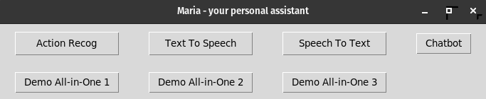
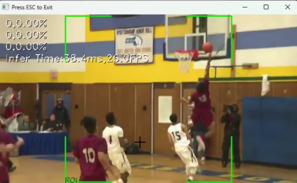
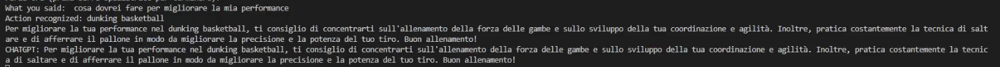
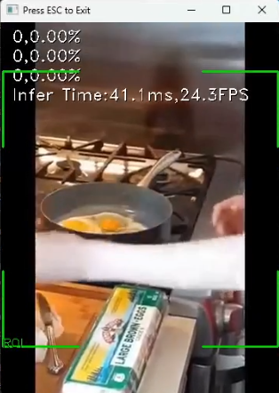
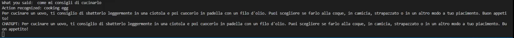
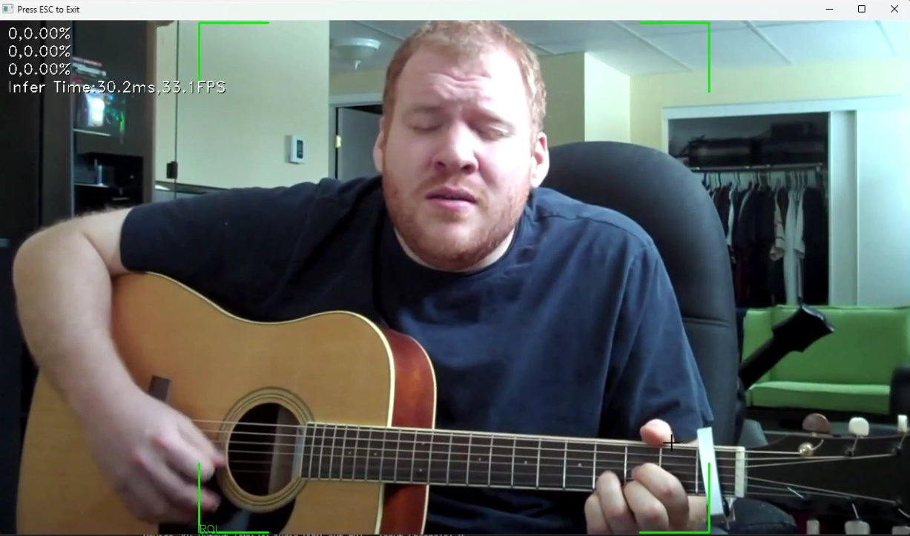
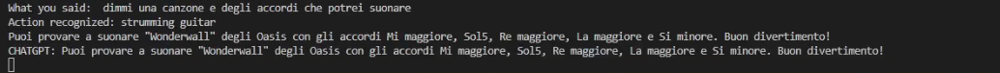

# MariaAI


MariaAI (Maria) is your personal assistant, powered by AI. It can help you with your daily tasks, like giving you tips on how to improve your productivity, or even help you with your homework.

Maria is powered by OpenAI's GPT-3.5, which allows her to generate human-like responses to your questions.

## Requirements
- Python 3.11.6
- Linux or Windows (MacOS is untested)

## Setup
1. Create a new virtual environment
```
python -m venv .env
```

2. Activate the virtual environment
```
source .env/bin/activate
```

3. Install requirements.txt
```
pip install -r requirements.txt
```

4. (Linux) Install via apt these packages
```
sudo apt-get install python3-tk portaudio19-dev python3-pyaudio
```

5. (development) Install and run `pre-commit` hook in the repo:
```
pre-commit install
pre-commit run --all
```

6. (optional) Generate OpenAI API key through **https://platform.openai.com/api-keys** and paste it into `secrets.env` file. See `secrets.env.sample` for more information


7. Run the application
```
python main.py
```

## Usage

Click on the button to start the assistant. You can try the individual features by clicking on the respective buttons.

If you want to try an interactive demo (requires OpenAI Token), click on the "Demo all-in-one" buttons.

## Screenshots

 
 
 